# B1 Linux - TP2

## Partie 1 - Exploration locale

### 1 - Affichage d'informations sur la pile TCP/IP locale

*>>> ipconfig /all*

**NOM** : MediaTek Wi-Fi 7 MT7925 Wireless LAN Card

**ADRESSE MAC** : 48-45-E6-8C-67-67

**ADRESSE IP** : 10.33.68.42

**ADRESSE RÉSEAU** : 10.33.68./20

**ADRESSE BROADCAST** : 10.33.68.255

**NOM** : Realtek PCIe GbE Family Controller

**ADRESSE MAC** : 18-3D-2D-EF-2A-0F

**ADRESSE IP** : Aucune (pas connecté)

La commande pour connaître l'adresse IP de la passerelle de votre carte WiFi est "*ipconfig /all*" dans un cmd par exemple

Pour obtenir les informations en passant par des méthodes graphiques soit GUI on doit : 

Aller dans **Paramètres** puis **Réseau et Internet** :

Ensuite aller dans **Propriétés du Matériel** :

Le Gateway permet de relier deux réseaux informatiques de types **différents**, donc à Ingésup elle permet de relier le réseau **interne** au réseau **externe**.

### 2 - Modifications des informations

#### A - Modification d'adresse IP - pt. 1

Dans mon réseau actuel il existe **4096** adresses car il s'agit d'un **/20**. Mais seulement **4094** sont disponibles donc de la **10.33.68.1** à la **10.33.68.4094**.

Je peux changer mon IP manuellement en allant encore dans **Paramètres** puis **Réseau et Internet** :

---

#### B - nmap

*>>> nmap -sn -PE 10.33.68.0/20*

*>>> nmap -sL -PE 10.33.68.0/20*

---

#### C - Modification d'adresse IP - pt. 2

Avec la commande *"nmap -sn 10.33.68.0/20"* j'ai pu obtenir une adresse IP libre : **"10.33.68.85"** et avoir pu la modifier comme précédemment 

Après avoir modifié le Gateway je n'ai plus accès à internet car il doit sûrement être incorrect 

---

## Partie 2 - Exploration locale en duo

### 3 - DHCP

**Configuration /24** :

Portable (enp108s0) : sudo ip addr add 172.16.18.10/24 dev enp108s0
Fixe (enp7s0) : sudo ip addr add 172.16.18.20/2
4 dev enp7s0

**Ping OK** : `ping -c 4 172.16.18.20` (0% loss)

**Tests masques** :
- **/20** : `172.16.0.10/20` ↔ `172.16.0.20/20` → **Ping OK**

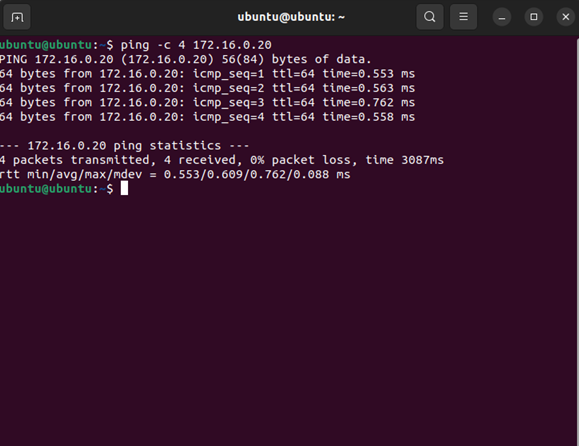

- **Nouveau /24** : `10.0.0.10/24` ↔ `10.0.0.20/24` → **Ping OK** 

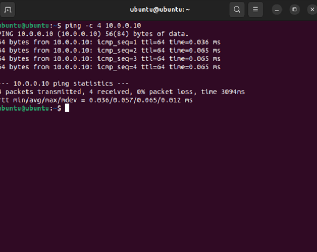

- **Plus petit réseau /30** : `172.16.18.1/30` ↔ `172.16.18.2/30` → **Ping OK**

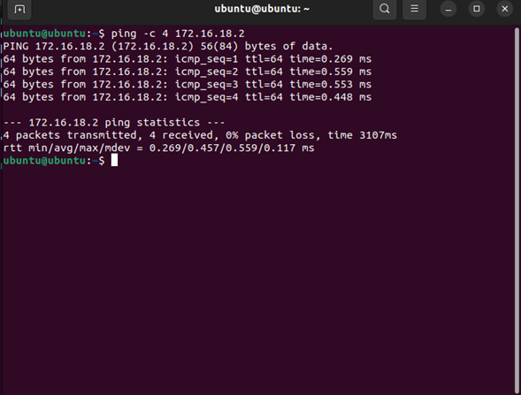

### 4. Utilisation d'un des deux comme gateway 

Ca, ça peut toujours dépann. Comme pour donner internet à une tour sans WiFi quand y'a un PC portable à côté, par exemple. 

**Portable = Gateway Internet** (WiFi actif), **Fixe = Client** (Ethernet uniquement).

**Sur FIXE** : 

sudo ip route replace default via 172.16.18.10 dev enp7s0
ip route show # default via 172.16.18.10 ✓

**Sur PORTABLE** (méthode Ubuntu officielle) :

nmcli con mod "Box-DZ78F6" ipv4.method shared
nmcli con up "Box-DZ78F6"

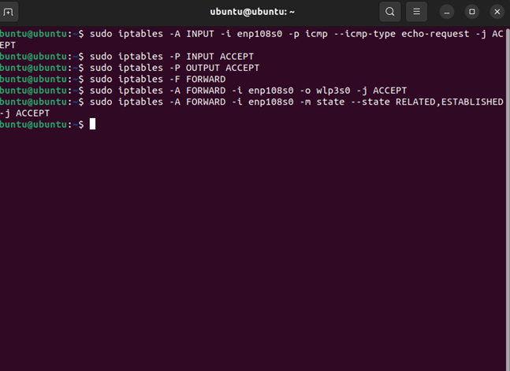

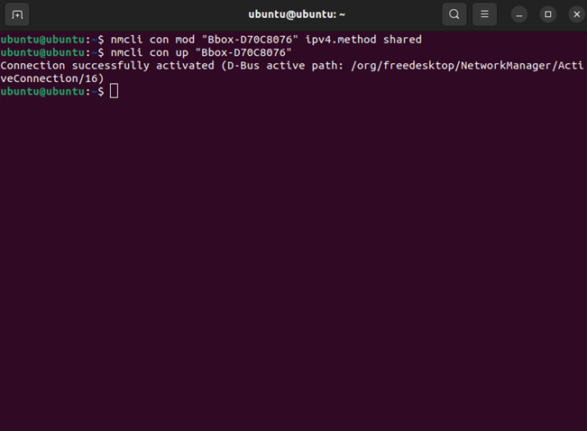

**Test** : `ping 8.8.8.8` sur **FIXE** → **0% loss, 64 bytes**

**Schéma** :

Internet ── WiFi(wlp3s0) ── PC Portable(enp108s0) ──Ethernet── PC Fixe(enp7s0)
172.16.18.10 câble RJ45 172.16.18.20

### 5. Petit chat privé ?

**netcat (nc)** installé par défaut Ubuntu.

**Configuration testée** :
- **FIXE (serveur)** : `nc -l 172.16.18.20 8888` → écoute **UNIQUEMENT** interface Ethernet
- **PORTABLE (client)** : `nc 172.16.18.20 8888` → connexion réussie

**Chat bidirectionnel fonctionnel** :

Portable → "Hello from laptop!"" → Fixe reçoit instantanément

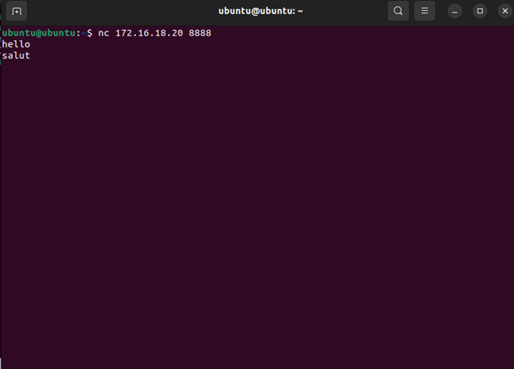

Fixe → "Salut depuis la tour!" → Portable reçoit instantanément

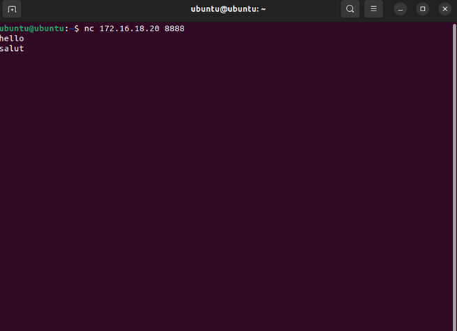

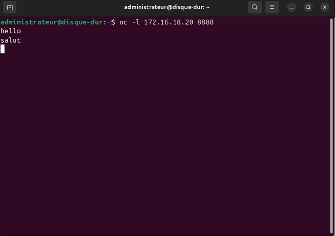

**Avancé - Écoute spécifique interface** :

nc -l 172.16.18.20 8888 # UNIQUEMENT enp7s0 (Ethernet), ignore WiFi
vs

nc -l 8888 # TOUTES interfaces (Ethernet + WiFi + loopback)

**Port 127.0.0.1** (local uniquement) : 

nc -l 127.0.0.1 9999 # Impossible de se connecter depuis l'extérieur

## 6. Wireshark

**Portable** : Wireshark installé (`sudo apt install wireshark -y`)

**3 captures sur enp108s0** :
1. **Ping local** → Filtre `icmp` → ICMP Echo Request/Reply 172.16.18.10↔20 ✅
2. **Netcat** → Filtre `tcp.port==8888` → TCP SYN/SYN-ACK/DATA bidirectionnel ✅  
3. **Gateway** → Filtre `icmp and ip.dst==8.8.8.8` → Trafic ICMP forwardé via portable ✅

**Screens disponibles** (TP oral).

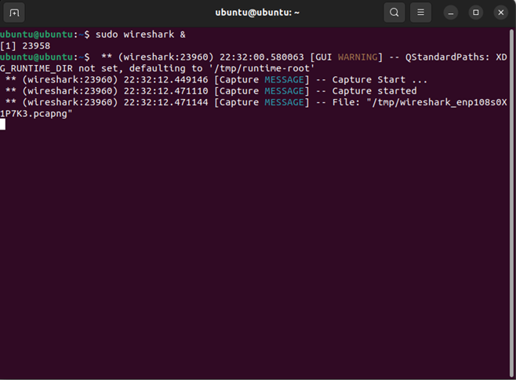

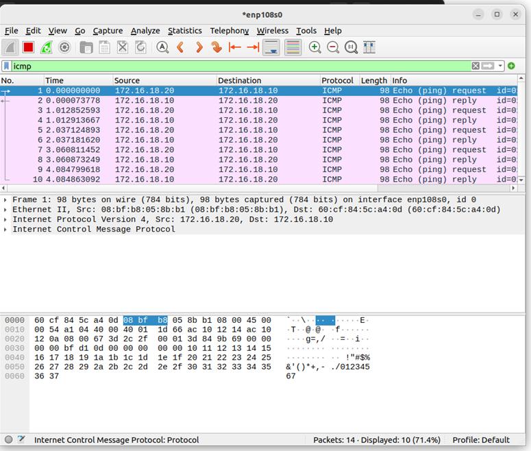

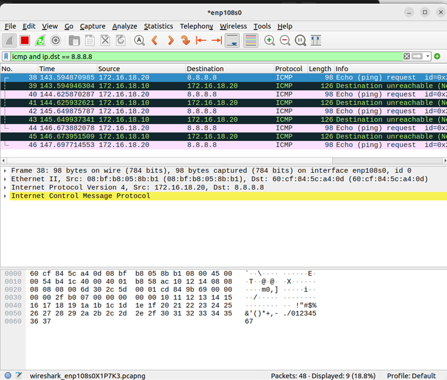

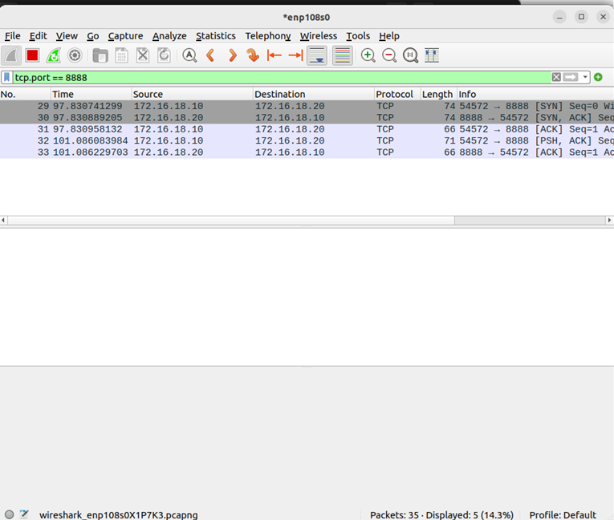

## 7. Firewall

**Activation** : `sudo ufw enable`

**ICMP ping** (iptables) : 

sudo iptables -A INPUT -p icmp --icmp-type echo-request -j ACCEPT
sudo iptables -A INPUT -p icmp --icmp-type echo-reply -j ACCEPT

**Netcat port 9999** : `sudo ufw allow 9999/tcp`

**Tests OK** : ping + nc 9999 fonctionnels ✅

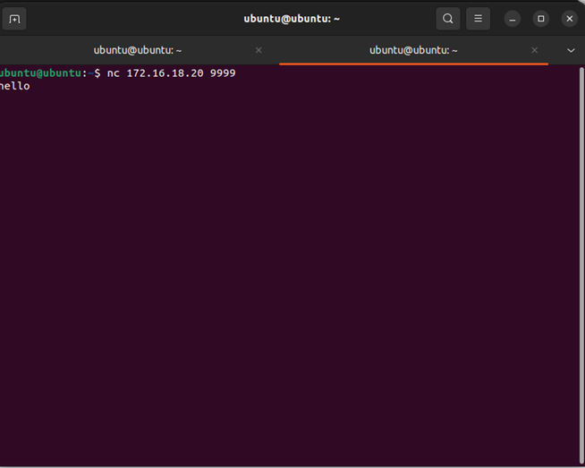

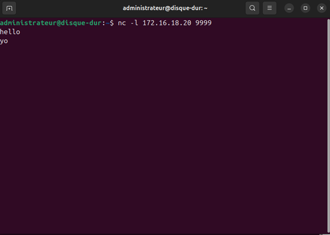

---

## Partie 3 - Manipulations d'autres outils/protocoles côté client

### 1 - DHCP

**Adresse du DHCP** : 10.33.79.254

**le bail expire** : samedi 24 janvier 2026 01:20:58

La commande "*ipconfig /renew*" me permet de demander au DHCP une nouvelle IP :

### 2 - DNS

**Adresse DNS** : 8.8.8.8

la commande "*nslookup*" me donne :

***nslookup google.com***

***nslookup ynov.com***

***nslookup 78.78.21.21***

***nslookup 92.16.54.88***

