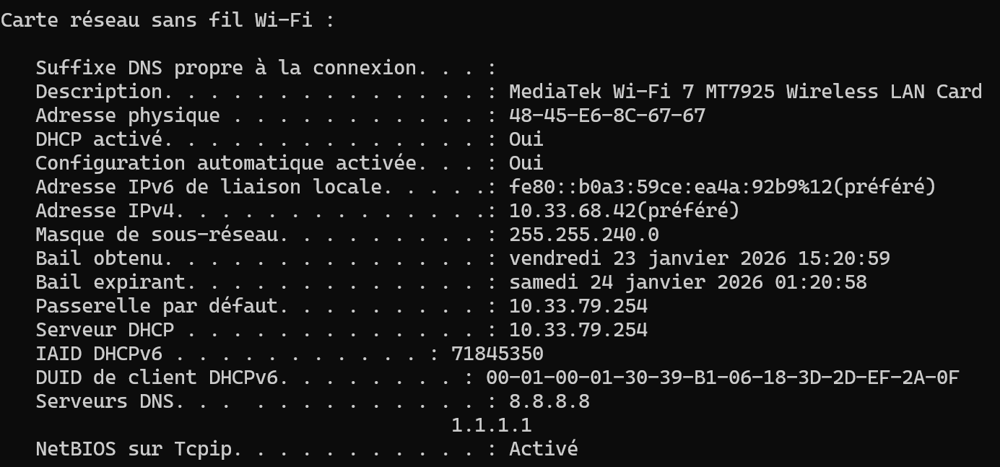
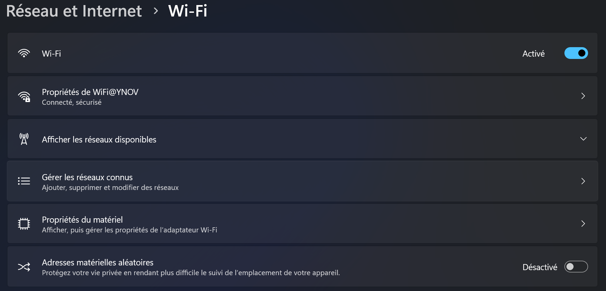
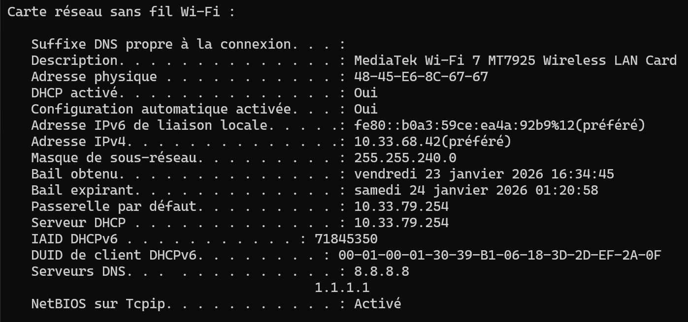
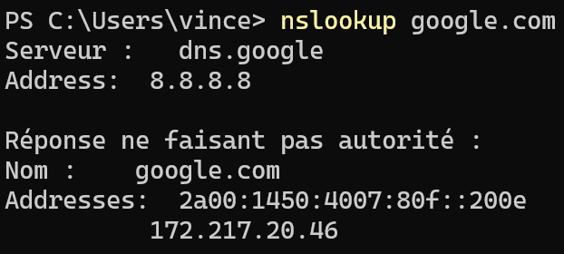
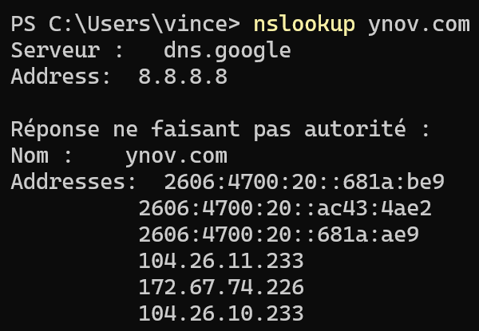
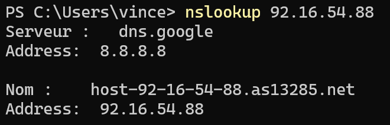

# B1 Linux - TP2

## Parti 1 - Exploration locale

### 1 - Affichage d'informations sur la pile TCP/IP locale

*>>> ipconfig /all*

**NOM** : MediaTek Wi-Fi 7 MT7925 Wireless LAN Card

**ADRESS MAC** : 48-45-E6-8C-67-67

**ADRESS IP** : 10.33.68.42

**ADRESS RESEAU** : 10.33.68./20

**ADRESS BROADCAST** : 10.33.68.255

**NOM** : Realtek PCIe GbE Family Controller

**ADRESS MAC** : 18-3D-2D-EF-2A-0F

**ADRESS IP** : Aucune (pas connecter)

La commande pour connaître l'adresse IP de la passerelle de votre carte WiFi est "*ipconfig /all* "dans un cmd par exemple

Pour obtenir les information en passant par des méthode graphique soit GUI on doit : 

Aller dans **Paramètre** puis **Réseau et Internet** :

Ensuite aller dans **Propriétés du Matériel** :

Le Gateway permet de relier deux réseaux informatiques de types **différents**, donc à ingésup elle permet de relier le réseau **interne** au réseau **externe**.

### 2 - Modifications des informations

#### A - Modification d'adresse IP - pt. 1

Dans mon réseau actuel il existe **4096** adresse car il s'agit d'un **/20**. Mais seulement **4094** sont disponible donc de la **10.33.68.1** à la **10.33.68.4094**.

Je peux changer mon ip manuelement en allant encore dans **Paramètre** puis **Réseau et Internet** :

---

#### B - nmap

*>>> nmap -sn -PE 10.33.68.0/20*

*>>> nmap -sL -PE 10.33.68.0/20*

---

#### C - Modification d'adresse IP - pt. 2

Avec la commande *"nmap -sn 10.33.68.0/20"* j'ai pus obtenir un adress ip libre : **"10.33.68.85"** et avoir pus la modifier comme précédement 

Apres  avoir modier le Gateway je n'est plus acces a internet car il doit surement être incorrect 

---

## Parti 3 - Manipulations d'autres outils/protocoles côté client

### 1 - DHCP

**Adresse du DHCP** : 10.33.79.254

**le bail expire** : samedi 24 janvier 2026 01:20:58

La commande "*ipconfig /renew*" me permet de demander au DHCP une nouvelle ip :

### 2 - DNS

**Adresse DNS** : 8.8.8.8

la commande "*nslookup*" me donne :

***nslookup google.com***

***nslookup ynov.com***

***nslookup 78.78.21.21***

***nslookup 92.16.54.88***

