# B1 Linux - TP3

## Parti 1 - Exploration en solo

### 1 - Base64

Apres avoir lancé les commandes suivantes :
```
dd if=/dev/urandom of=file_bin bs=1k count=50
openssl base64 -e -in file_bin -out file_bin_b64
```
J'obtien le fichier file_bin_b64 qui contient le contenu du fichier file_bin encodé en base64. ils ont quasiment la même taille.

- -rw-rw-r-- 1 administrateur administrateur **51200** févr. 13 16:24 file_bin
- -rw-rw-r-- 1 administrateur administrateur **69335** févr. 13 15:52 file_bin_b64

Apres avoir effectuer la commande ```diff -s file_bin file_bin2``` je sais que les fichiers sont bien different

### 2 - AES (Chiffrement symétrique)

Maintenant avec les commandes :
```
cat /usr/share/dict/words | grep ker  | tr "\n" " " >message
openssl enc -e -salt -in message -out message_c -aes256 -pbkdf2 -md sha256
```
je crée les fichiers "message" qui ma permit d'écrire tous les mots du dictionnaire aligné dans lequel il y a "ker" puis on a chiffré en aes256 dans le fichier "message_c"

Ensuite je vais décoder ce fichier "message_c" :
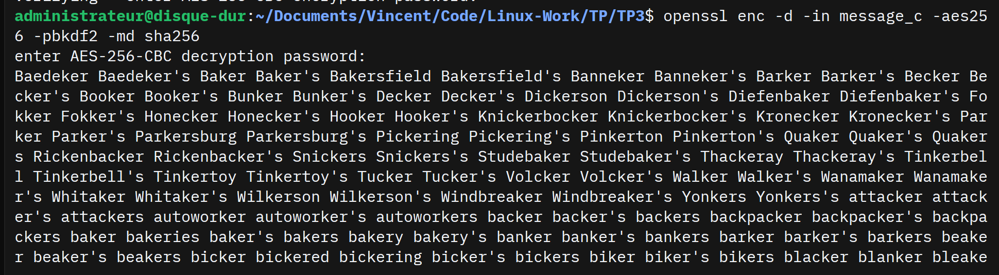

Avec la commande :
```
openssl enc -e -a -salt -in message -out message_c2 -aes256 -pbkdf2 -md sha256
```
J'obtient un fichier "message_c2" le meme chiffrement que "message_c" mais chiffrer en base64 

### 3 - RSA (Chiffrement asymétrique)

J'ai d'abord effectuer la commande :
```
openssl genrsa -out cle_ynov.pem 2048
openssl rsa -in cle_ynov.pem -text -noout
```
Ce qui ma permis de génère une paire de clés RSA que j'ai pus ensuite chiffrer:
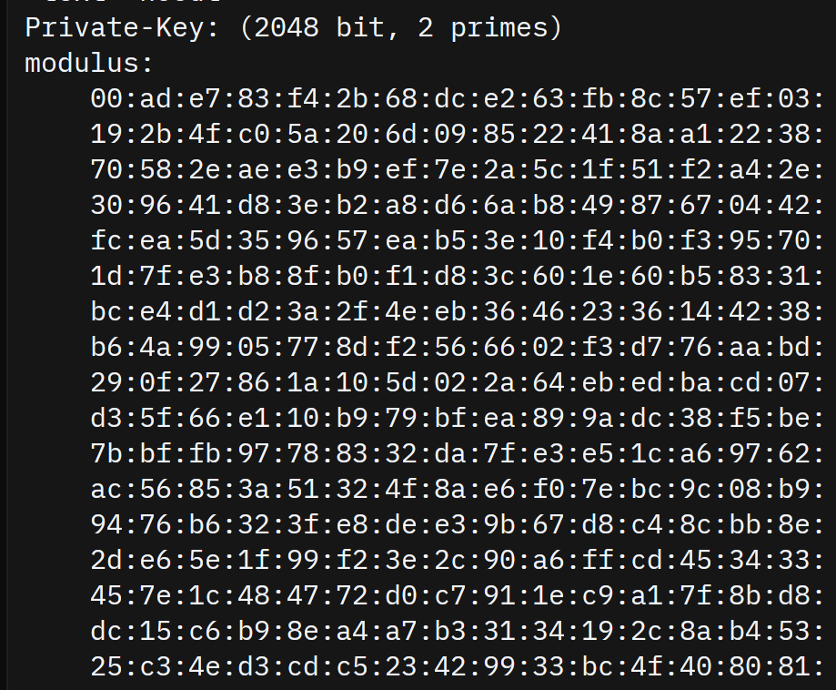

Ensuite je fait la commande : 
```openssl rsa -in cle_ynov.pem -out cle_ynov2.pem -aes256 ```
pour sécuriser mes clefs rsa

Je crée ensuite une clef publique avec la commande 
```openssl rsa -in cle_ynov.pem -pubout -out clepublique_ynov.pem```

J'ai crée un fichier "pass_ynov" dans lequelle j'y es mis "Password" que j'ai ensuite chiffrer avec la clef publique qu'on a crée juste avant avec la commande 
```openssl pkeyutl -encrypt -in pass_ynov -inkey clepublique_ynov.pem -pubin -out pass_ynov_c```
puis je les dechiffrer avec la clef privé en utilisant la commande 
```openssl pkeyutl -decrypt -in pass_ynov_c -inkey cle_ynov.pem```
Pour obtenir a nouveau "Password"

## Parti 2 - Explotation des connaissances

### A - Base64

### 1. Génération d’un fichier binaire

Pour crée contenant 100 Ko de données binaires aléatoires. je fait cette commande :
```dd if=/dev/urandom of=data.bin bs=1k count=100```
et pour vérifier sa taille :
```ls -lh data.bin```
et on peut voir qu'il fait bien 100ko :
```-rw-rw-r-- 1 administrateur administrateur 100K févr. 15 16:47 data.bin```

### 2. Encodage

Tout d'abord je fait mon chiffrement en base64 :

```openssl base64 -e -in data.bin -out data.b64```

Ensuit j'afficher le contenue avec la commande :

```cat data.b64```

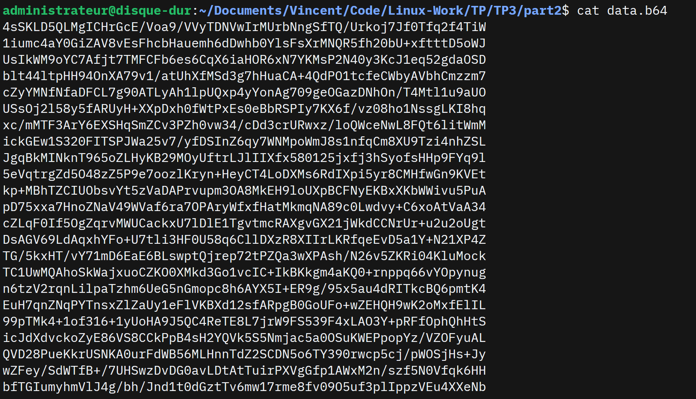

Puis je comparer les tailles :

```ls -lh data.bin data.b64```

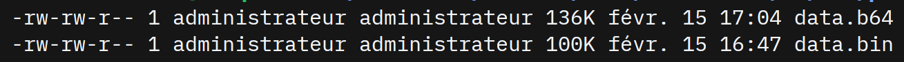

On peux remarquer quelle fait bien 30% de plus en taille chiffrer

### 3. Décodage

Pour finir on vas décoder le fichier Base64 :

```openssl base64 -d -in data.b64 -out data_restored.bin```

Puis vérifier que les fichiers sont identiques :

```diff -s data.bin data_restored.bin```

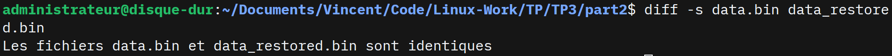

### 4. Question

**1.** Non c'est juste un encodage, n'importe qui peut décoder sans clé donc il n'y a aucune sécurité

***2.** la Base64 utilise 4 caractères pour représenter 3 octets binaires donc plus lourd

**3.** *Comme on pus voir précédement elle est a peux pres 30% plus grande

**4.** La commande diff ou cmp, ou comparer leurs hash (sha256sum, md5sum).

### B - Chiffrement symétrique – AES

### 1. Création d’un message

Je fait la commande ```nano confidentiel.txt``` puis j'y ajoutes mon nom ect...

```
Vincent
15 février 2026
Ceci est un document confidentiel.
Il contient des informations sensibles.
Ce fichier sera chiffré avec AES-256.
La sécurité des données est primordiale.
OpenSSL est un outil puissant pour la cryptographie
```
### 2. Création d’un message

Puis je chiffre le fichier avec la commande : ```openssl enc -e -salt -in confidentiel.txt -out confidentiel.enc -aes256 -pbkdf2 -md sha256```

Je vérifie qu'il est bien en binéaire : ```cat confidentiel.enc```

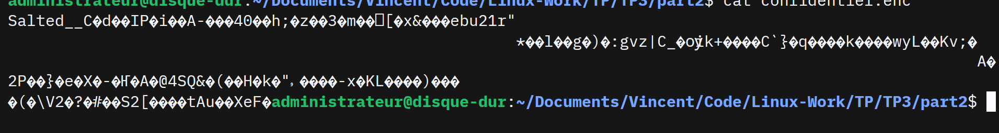

### 3. Déchiffrement

Je le d"échiffre ensuite avec la commande : ```openssl enc -d -in confidentiel.enc -out confidentiel_dechiffre.txt -aes256 -pbkdf2 -md sha256```

et je vérifie qu'il est identique : ```diff -s confidentiel.txt confidentiel_dechiffre.txt```

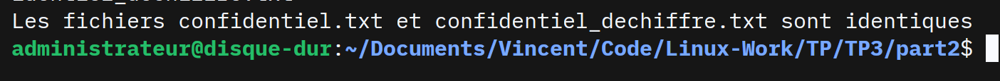

### 4. Analyse

Je rechiffre le meme TXT pour voir s il ya une diiference entre les deux :
```openssl enc -e -salt -in confidentiel.txt -out confidentiel2.enc -aes256 -pbkdf2 -md sha256```

Puis je les compare : ```diff confidentiel.enc confidentiel2.enc```

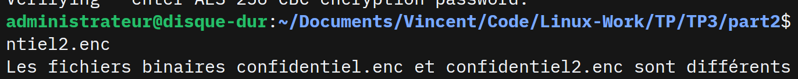

On peux voir qu'il on une différence et c'est normal car ils ont pas le meme sel.

### 5. Questions

**1.** Le sel est différent à chaque chiffrement, donc le résultat change même avec le même mot de passe comme dit précédement

**2.** Pour que le chiffrement soit bien aléatoir a chaque fois ce qui protege mieux

**3.** Le déchiffrement échoue ou produit des données corrompues. Les options doivent être identiques.

**4.** Pour dériver une clé robuste à partir du mot de passe en appliquant de nombreuses itérations, ralentissant les attaques par force brute.

**5.** la différence :
- Encodage (Base64) : transformation réversible sans clé, aucune sécurité
- Chiffrement (AES) : nécessite une clé secrète, assure la confidentialité

### C. Cryptographie asymétrique – RSA

### 1. Génération de clés

Tout d'abord on générer la paire de clés RSA protégée :
```openssl genrsa -aes256 -out rsa_private.pem 2048```

Puis on exporter la clé publique :
```openssl rsa -in rsa_private.pem -pubout -out rsa_public.pem```

On afficher les paramètres de la clé privée :
```openssl rsa -in rsa_private.pem -text -noout```

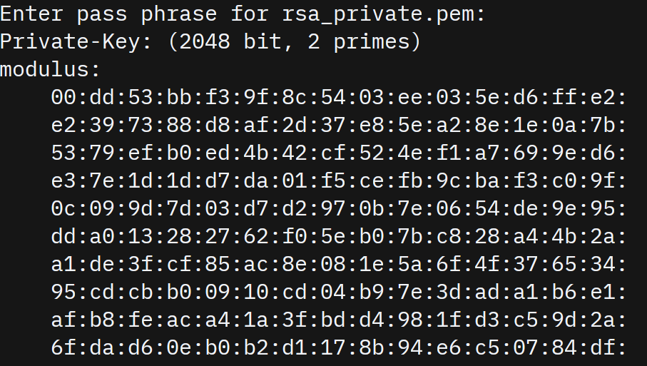

Et on afficher les paramètres de la clé publique :
```openssl rsa -in rsa_public.pem -pubin -text -noout```

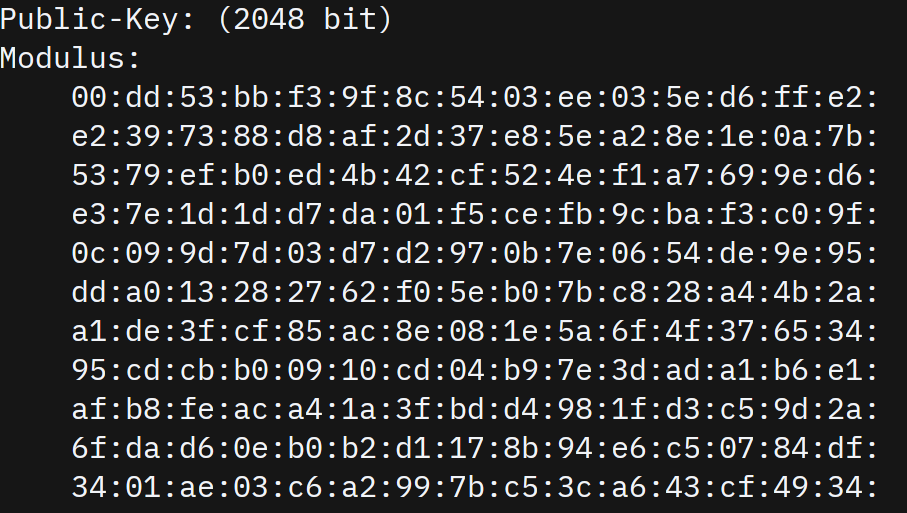

La comparaison entre les deux est la suivante :
- Clé privée : contient le modulo, exposant public (65537), exposant privé, prime1, prime2, exposants 1 et 2, coefficient donc enormement plus long
- Clé publique : contient uniquement le modulo et l'exposant public (65537)

### 2. Chiffrement asymétrique

Ensuite je créer le fichier :
```nano secret.txt```

ou dans lequelle jy écrit :
```
MESSAGE TRES TRES SECRET DE LA MORT QUI TUE
```

puis je vais chiffrer avec la clé publique :
```openssl pkeyutl -encrypt -in secret.txt -inkey rsa_public.pem -pubin -out secret.enc```

et le déchiffrer avec la clé privée :
```openssl pkeyutl -decrypt -in secret.enc -inkey rsa_private.pem```


Puis on fini par sauvgarder la clé prive dans un fichier :
```openssl pkeyutl -decrypt -in secret.enc -inkey rsa_private.pem -out secret_dechiffre.txt```

### 3. Questions

**1.** Parce qu'elle permet de déchiffrer tous les messages destinés au propriétaire. Si elle est compromise, la sécurité est totalement perdue.

**2.**  RSA est très lent et ne peut chiffrer que des données de taille limitée (inférieure à la taille de la clé).
 
**3.** La différence :
- Clé publique : modulo + exposant public uniquement
- Clé privée : modulo + exposant public + exposant privé + prime1 + prime2 + autres paramètres secrets
- 
**4.** C'est le produit de deux nombres premiers (p×q). Il définit l'espace mathématique des opérations de chiffrement/déchiffrement.

**5.** Chiffrement hybride : RSA (lent) pour échanger la clé, AES (rapide) pour chiffrer les données volumineuses. Meilleur compromis vitesse/sécurité.

### D. Signature numérique

### 1. Création et signature

Tout d'abord nous allons créer le fichier :
```nano contrat.txt```

On y ajoute :
```
Ceci est un contrat tres confidentiel
```

Puis on vas générer l'empreinte (hash) :
```sha256sum contrat.txt```

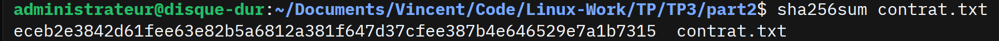

et faire signer le fichier avec la clé privée :
```openssl dgst -sha256 -sign rsa_private.pem -out contrat.sig contrat.txt```

### 2. Vérification

Ensuite on fait vérifier la signature avec la clé publique :
```openssl dgst -sha256 -verify rsa_public.pem -signature contrat.sig contrat.txt```

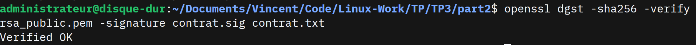

Puis on va modifier légèrement le fichier :
```nano contrat.txt```

```
Ceci est un contrat tres   ss confidentiel
```

Et pour finir refaire la vérification pour tester si il est toujours correcte :
```openssl dgst -sha256 -verify rsa_public.pem -signature contrat.sig contrat.txt```

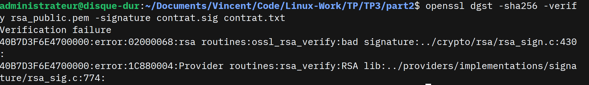

### 3.Questions

**1.** La vérification échoue 

**2.** Le hash du fichier modifié est différent du hash signé. La moindre modification change complètement l'empreinte donc va générer une erreur.

**3.** On signe le hash plutôt que le fichier entier. Plus rapide et garantit l'intégrité mais tout changement modifie le hash.

**4.** La différence : 
- Chiffrement : clé publique chiffre → clé privée déchiffre (confidentialité)
- Signature : clé privée signe → clé publique vérifie (authenticité + intégrité)
