# B1 Linux - TP4

## Partie 1 – Mise en place de l'environnement virtualisé

Je commence par créer ma VM que je mets en **Réseau : Bridged Adapter**
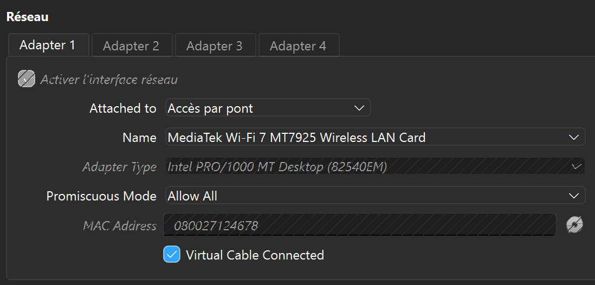

Puis j'essaye de Ping ma VM à partir de mon Windows
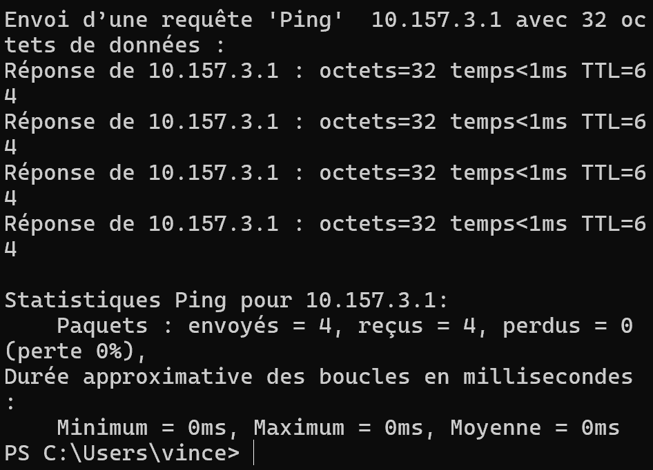

---

## Partie 2 – Serveur SSH

J'installe ensuite OpenSSH sur ma VM pour pouvoir me connecter à ma VM en SSH à partir de mon pc : 
```sudo apt install openssh-server```

Et maintenant je me connecte depuis mon pc :
```ssh vincent@10.157.3.1```


Puis je vais générer une clé SSH sur la machine cliente
```ssh-keygen```

puis on copie dans un fichier et puis on fait la commande :
```type $env:USERPROFILE\.ssh\id_ed25519.pub | ssh vincent@192.168.1.23 "cat >> ~/.ssh/authorized_keys"```
ce qui va me permettre de me connecter en ssh sans mot de passe

---

## Partie 3 – Sécurisation SSH

Tout d'abord je vais modifier quelques règles de connexion sur ma VM :

- Interdisez l'accès root.
- Désactivez l'authentification par mot de passe.
- Changez le port par défaut (22) pour réduire les tentatives de brute-force.

Avec les changements suivants : 
```
PermitRootLogin no
PasswordAuthentication no
Port 2222
```

Puis on teste avec la commande suivante : 
```ssh -p 2222 vincent@192.168.1.23```

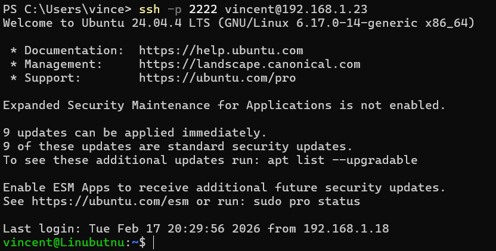

Pour finir je crée un alias pour me connecter plus facilement donc j'ouvre sur mon pc le fichier `config` dans le dossier `.ssh` et j'y ajoute :
```
Host serveur-tp
    HostName 192.168.1.23
    User vincent
    Port 2222
```

Puis je teste ;
```ssh -v serveur-tp```

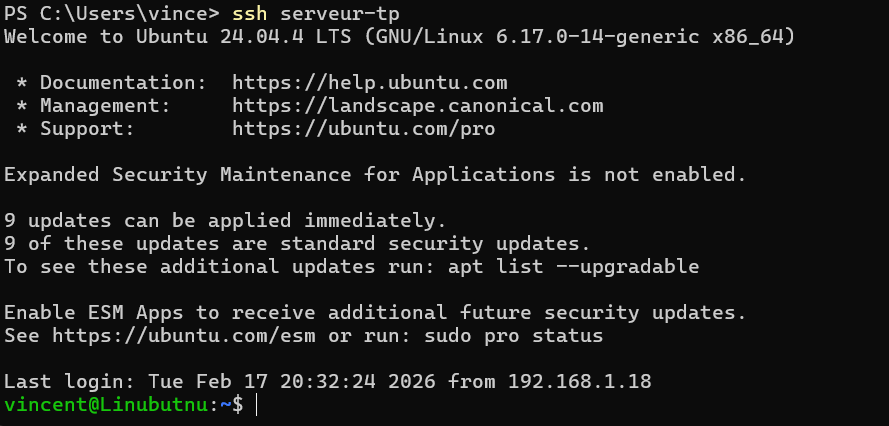

---

## Partie 4 – Transfert de fichiers

Je transfère un fichier de mon pc vers ma VM 
```scp -P 2222 "C:\Users\vince\OneDrive\Bureau\text.txt" vincent@192.168.1.23:/home/vincent/ text.txt```

Et je vérifie que ça a bien fonctionné :
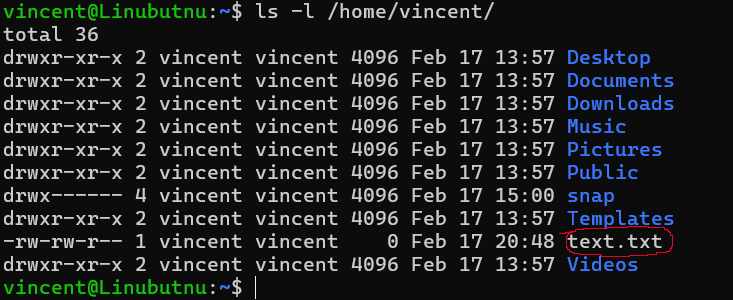

```
put fichier.txt          # envoyer un fichier vers le serveur
put -r dossier           # envoyer un dossier vers le serveur
get fichier.txt          # récupérer un fichier du serveur
ls                       # lister les fichiers sur le serveur
cd /home/vincent/        # changer de répertoire sur le serveur
lcd C:\Users\vince\Docs  # changer de répertoire local
exit                     # quitter SFTP
```

Pour synchroniser un dossier entre ma VM et mon pc je fais cette commande
```rsync -avz -e "ssh -p 2222" dossier/ vincent@192.168.1.23:/home/vincent/```

## Partie 5 – Analyse des logs et sécurité

Je regarde les logs d'autorisation ssh sur ma VM :
```sudo tail -f /var/log/auth.log```

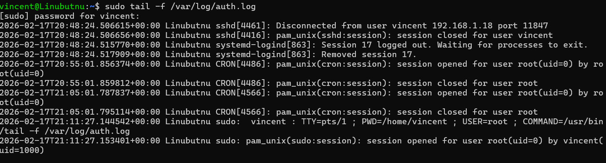

Puis j'installe fail2ban et le teste :
```sudo apt install fail2ban```

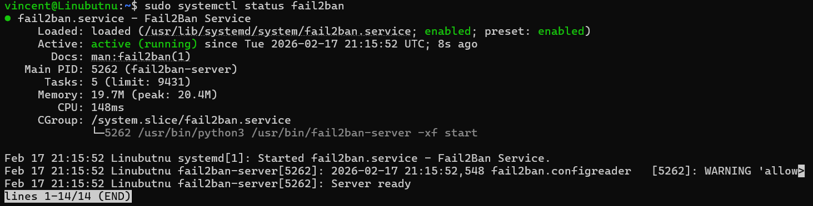

## Partie 6 – Analyse des logs et sécurité

Tout d'abord on installe **nginx** :
```
sudo apt install nginx -y
sudo systemctl start nginx
sudo systemctl status nginx
```

puis on essaye de le connecter à mon port **8080** de mon pc :  
```ssh -L 8080:localhost:80 serveur-tp```

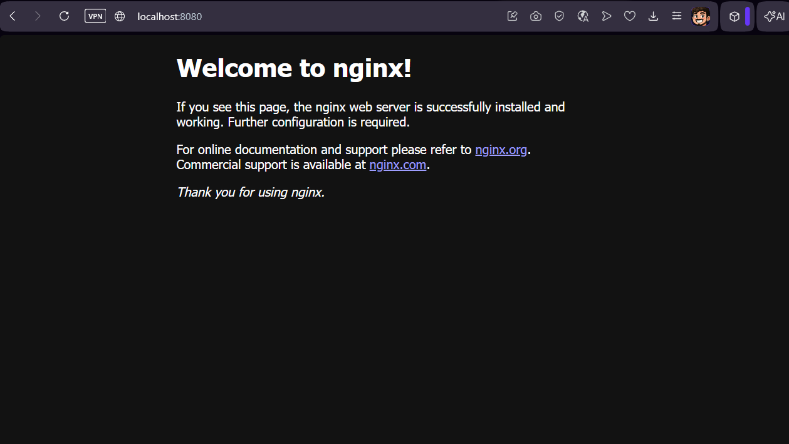

## Partie 7 – Nginx et HTTPS

Tout d'abord j'installe Nginx et l'active :
```
sudo apt install nginx -y
sudo systemctl start nginx
sudo systemctl enable nginx
sudo systemctl status nginx
```

Ensuite je crée un site test dans /var/www/site-tp et un fichier index.html avec un message "Hello World!" :
```
sudo mkdir -p /var/www/site-tp
sudo nano /var/www/site-tp/index.html
```

Ensuite nous allons configurer Nginx pour servir ce site sur HTTP : 
```
sudo ln -s /etc/nginx/sites-available/site-tp /etc/nginx/sites-enabled/
sudo nginx -t
sudo systemctl reload nginx
```

Pour finir je génère un certificat auto-signé pour HTTPS et configure la redirection HTTP → HTTPS :
```
sudo mkdir -p /etc/nginx/ssl
sudo openssl req -x509 -nodes -days 365 -newkey rsa:2048 \
  -keyout /etc/nginx/ssl/site-tp.key \
  -out /etc/nginx/ssl/site-tp.crt
sudo nano /etc/nginx/sites-available/site-tp
```

Je le mets ensuite en HTTPS :
```
sudo nano /etc/nginx/sites-available/site-tp
sudo nginx -t
sudo systemctl reload nginx
```

Pour finir je teste :
```curl -k https://192.168.1.23```

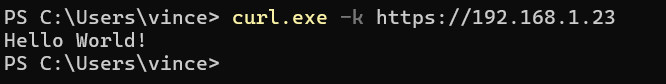

## Partie 8 – Firewall et permissions

Tout d'abord j'autorise Nginx dans le firewall (ports HTTP/HTTPS) :
```
sudo ufw enable
sudo ufw allow 'Nginx Full'
sudo ufw allow 2222
```

Je change ensuite les autorisations :
```sudo ufw status verbose```

Ensuite je vérifie si les autorisations sont correctes :
```ls -la /var/www/site-tp/```

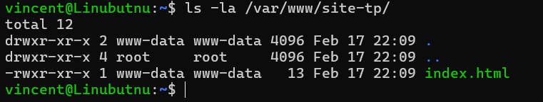

Pour finir je vérifie que sur mon pc j'arrive toujours à m'y connecter :
```curl.exe -k https://192.168.1.23```

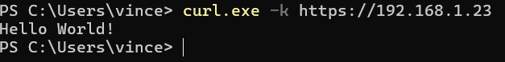

## Partie 9 – Validation finale

1 – SSH sur port personnalisé + clé uniquement
```sudo sshd -T | grep -E "port|passwordauthentication|permitrootlogin"```

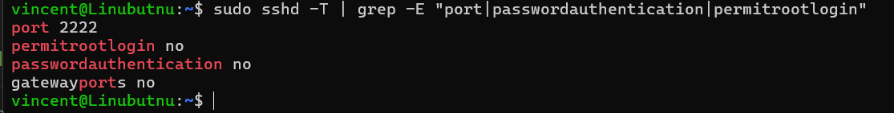

2 – Fail2Ban actif
```
sudo systemctl status fail2ban
sudo fail2ban-client status sshd
```

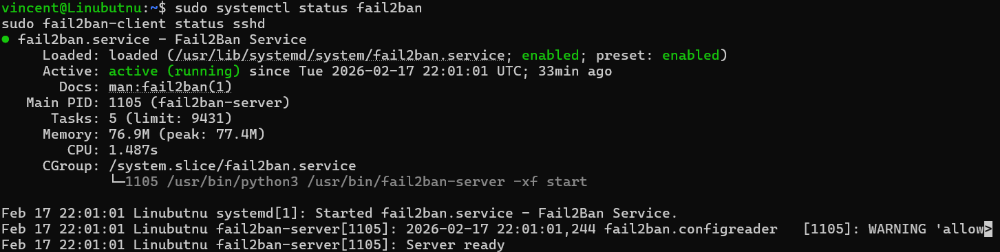

3 – Transferts de fichiers
```scp -P 2222 "C:\Users\vince\OneDrive\Bureau\text.txt" vincent@192.168.1.23:/home/vincent/```


4 – Nginx HTTP + HTTPS + redirection
```curl.exe -k https://192.168.1.23```

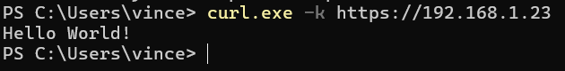

5 – Certificat SSL valide
```sudo openssl x509 -in /etc/nginx/ssl/site-tp.crt -noout -text | grep -E "Issuer|Subject|Not After"```

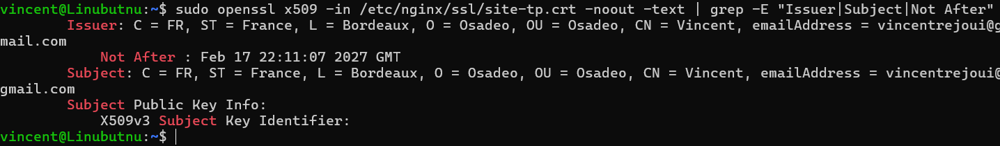

6 – Firewall + permissions
```ls -la /var/www/site-tp/```

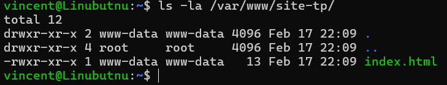

Tout est bon et fonctionne !!!