# B1 Linux - TP5

## Partie 1 – Prise en main et sécurisation

### 1. Accès à l'interface

Après avoir tout configuré sur ma VM Ubuntu et pfSense j'essaye de me connecter à ma VM pfSense par Ubuntu via Firefox :
```https://192.168.56.104```


1. 192.168.56.104 
2. 10.0.2.15/24
3. Pour chiffrer la communication entre ton navigateur et l'interface d'administration de pfSense. Ça empêche quelqu'un qui snifferait le réseau de voir tes identifiants et tes actions
4. Parce que les identifiants par défaut (admin/pfsense) sont publics et connus de tous

### 2. Sécurisation de l'accès administrateur

Ensuite je change le mot de passe :


1. Dans le menu System puis dans User Manager et onglet Users
2. C'est un mot de passe qui est : Long - Complexe - Imprévisible - Unique
3. Parce que le compte admin a tous les pouvoirs sur le pare-feu

## Partie 2 – Prise en main et sécurisation

### 3. Vérification des interfaces

Pour vérifier l'affectation WAN / LAN je vais directement sur le dashboard et je vérifie : 

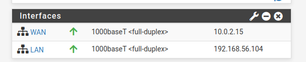

On remarque qu'on a bien :
**WAN** : avec l'IP 10.0.2.15/24 
**LAN** : avec l'IP 192.168.56.104 

## Partie 3 – Configuration des services réseau

### 4. DHCP

Tout d'abord je configure le serveur DHCP pour le réseau LAN : 

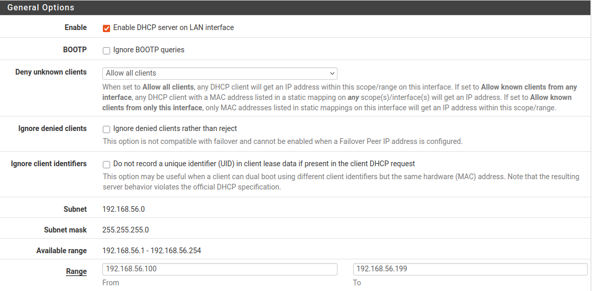

(je fais bien attention de mettre la range entre 100 & 199 comme indiqué sur VirtualBox)

1. Les raisons pour lesquelles on utilise un serveur DHCP : Simplicité - Évite les conflits d'IP - Flexibilité - Gestion centralisée - Gain de temps
2. Celles qui sont disponibles soit 192.168.56.100 à 192.168.56.200 (dans notre cas)
3. Les suivantes :
- L'adresse réseau : 192.168.56.0 (identifie le réseau lui-même)
- L'adresse de broadcast : 192.168.56.255 (diffusion à tous)
- L'IP du pfSense/passerelle : 192.168.56.104 (déjà utilisée)
- Les IPs fixes déjà attribuées manuellement à des serveurs/équipements
- Idéalement, toutes les adresses basses (.1 à .99) pour avoir une zone réservée aux IPs statiques

On peut voir que ma VM Ubuntu obtient une IP via mon DHCP : 

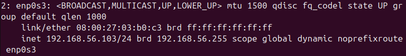

### 5. DNS

Ensuite j'active le résolveur DNS et le configure : 

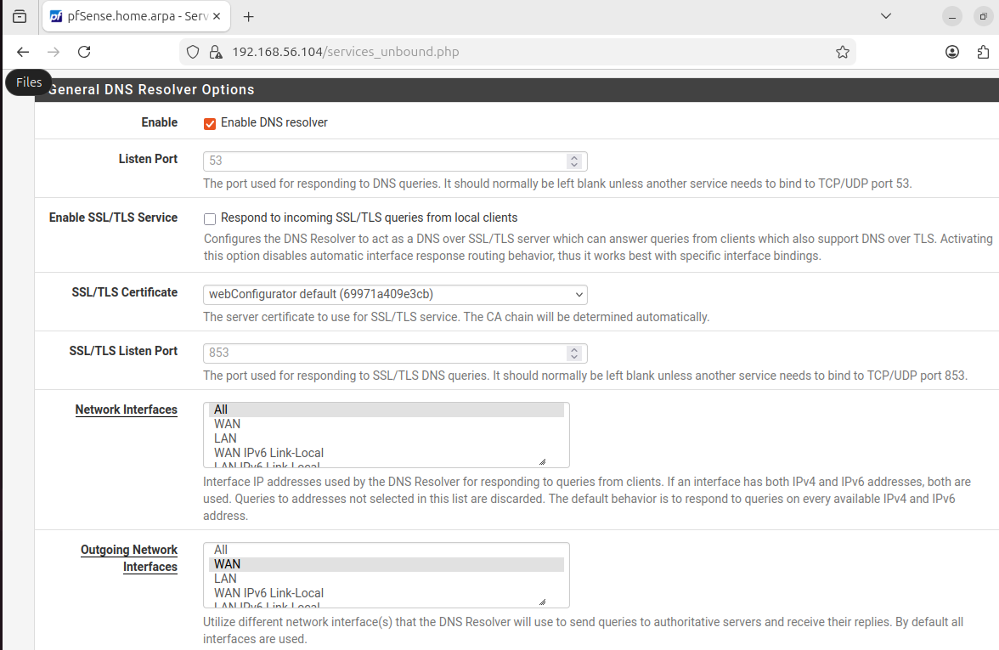

1. Les raisons sont que le serveur DNS permet de : Centralisation - Cache DNS - Filtrage/Sécurité - Logs centralisés  - Contrôle - Résolution locale
2. C'est car on est connecté à une IP donc à internet donc le ping 8.8.8.8 arrive à passer mais quand il s'agit d'un nom de domaine il faut passer par le DNS

## Partie 4 – Autoriser l'accès Interne

### 6. Règles de pare-feu

Je regarde d'abord les règles de mon pare-feu et j'observe qu'elles sont déjà parfaites par défaut :

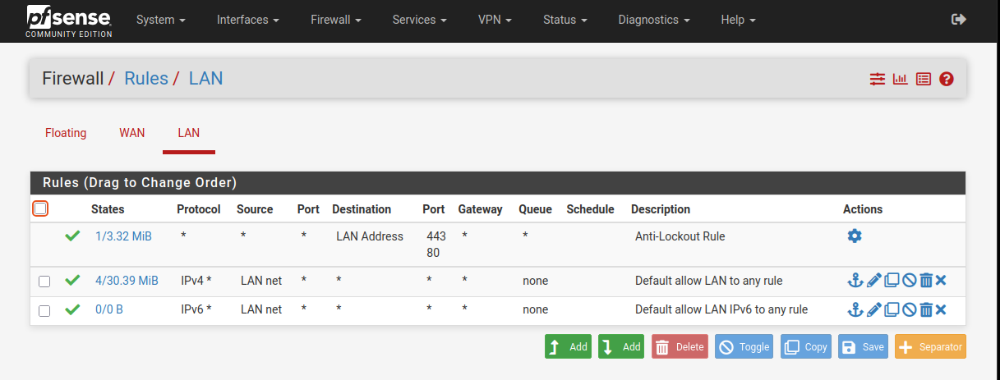

1. LAN ou 192.168.56.0/24
2. On veut que les machines LAN puissent accéder à n'importe quelle destination sur Internet donc any
3. Oui (protocole any) pour pouvoir accéder à tout 

Pour finir on fait les tests :

1. Ping vers pfSense :
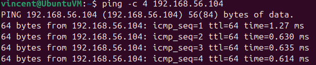

2. Ping vers Internet (8.8.8.8) :
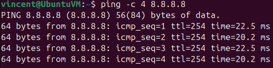

3. Test DNS :
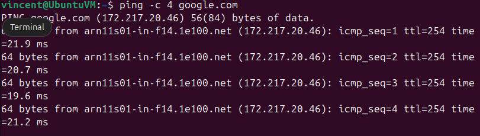

4. Accès web (dans le terminal) :
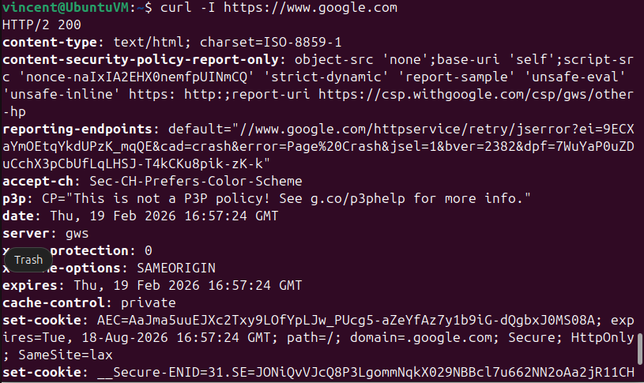

### 7. NAT

Ensuite on va observer que toutes les configs sont bien réglées sur les règles NAT :

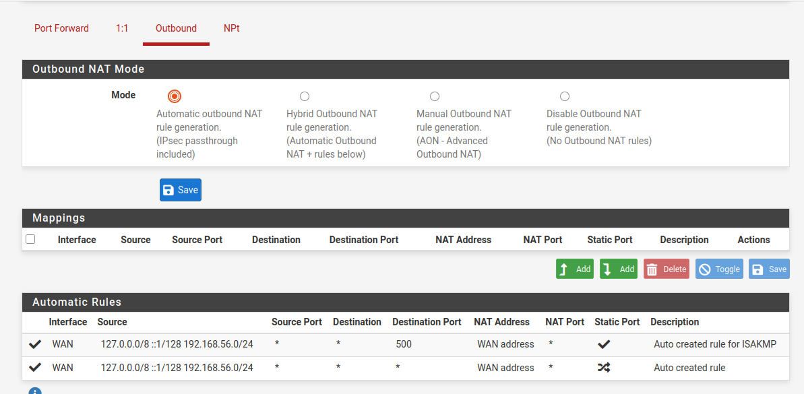

On remarque que tout est bon.

1. Le NAT pfSense traduit les IP privées du LAN en IP WAN pour que le trafic soit routable sur Internet
2. La différence est la suivante :

**NAT Automatique** : 
- pfSense crée automatiquement toutes les règles NAT nécessaires
- Dès qu'il détecte une interface WAN, il génère les règles pour tous les réseaux LAN

**NAT Manuel** :
- Tu dois créer manuellement chaque règle NAT
- Contrôle total : choix des sources, destinations, ports, traduction

3. Sur pfSense on va sur **Diagnostics** puis sur **States** ensuite on filtre avec l'IP Ubuntu (192.168.56.103) et on voit la traduction en temps réel : 192.168.56.103:port → 10.0.2.15:port

## Partie 5 – Filtrage

### 8. Blocage d'un site spécifique

Tout d'abord je bloque l'accès à un site web en passant par le DNS (facebook.com) :

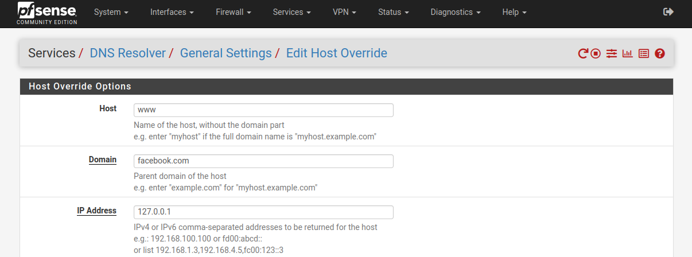

Puis je teste si ça fonctionne bien (sur terminal) : 
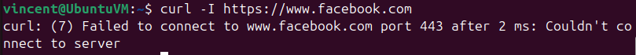

(sur firefox) :
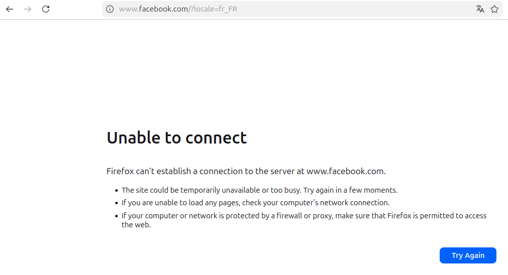

1. Par nom de domaine car les gros sites changent régulièrement d'IP
2. Le blocage fonctionne quand même. HTTPS chiffre seulement le contenu, pas l'adresse IP de destination
3. VPN/Proxy - IP multiples - IP qui changent - DNS alternatif

### 9. Blocage d'une catégorie de sites (jeux d'argent)

Maintenant on va enlever tout accès aux sites de Jeux d'argent à toute personne passant par le firewall :

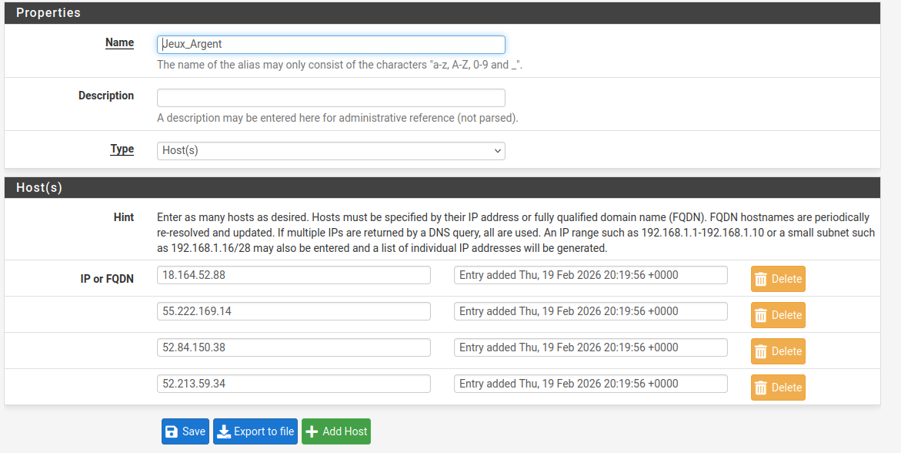

1. On ne le fait pas car : Trop de règles = difficile à gérer et à maintenir - Ralentit le pare-feu - Impossible à lire - Modification compliquée
2. En allant dans **Firewall** puis **Aliases**
3. En passant par **Status** puis dans **System Logs** puis dans **Firewall** et on cherche les lignes rouges "Block"

## Partie 6 – Aller plus loin (partie plus tendue)

### 10. Blocage par catégorie

Comme avant on ban tout accès aux réseaux sociaux donc je commence par créer mon alias :


Ensuite je crée ma règle de blocage :
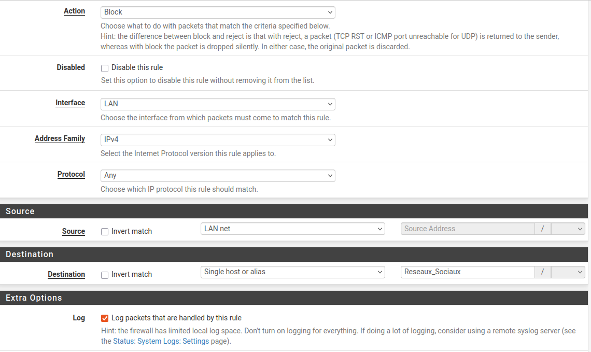

Je finis par observer les logs :
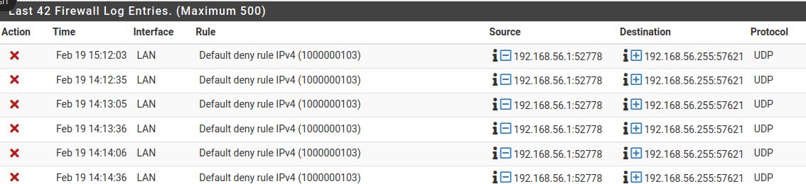

1. Elle ne s'affecte pas 

### 11. Blocage par catégorie