# B1 Linux - TP6

J'installe tout d'abord Openvpn

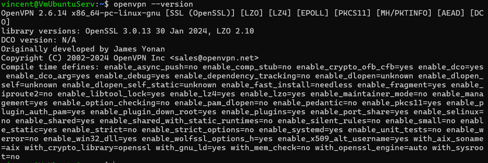

## Partie 1 – Comprendre la PKI

1. Elle permet de : Signer et émettre des certificats numériques - Valider l'authenticité - Créer une chaîne de confiance

2. La différence :
Clé privée (Private Key) :
- Fichier secret à garder absolument confidentiel
- Permet de déchiffrer les données et prouver son identité
- Si elle est compromise = tout est compromis
- Extension : .key
- Ne doit JAMAIS être partagée

Certificat (Certificate) :
- Fichier public contenant l'identité + la clé publique
- Signé par la CA pour prouver son authenticité
- Permet de chiffrer les données et vérifier l'identité
- Extension : .crt ou .pem
- Peut être partagé librement

3. Pour les raisons suivantes : Pour l'authentification mutuelle - Pour le chiffrement - Pour la sécurité - Sans certificats

Je commence par créer un environnement PKI :
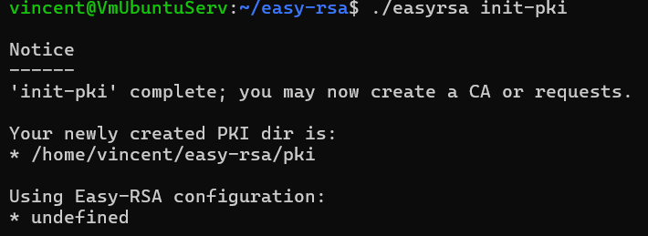

Ensuite je crée mon certificat d'autorité avec la commande :
```./easyrsa build-ca nopass```

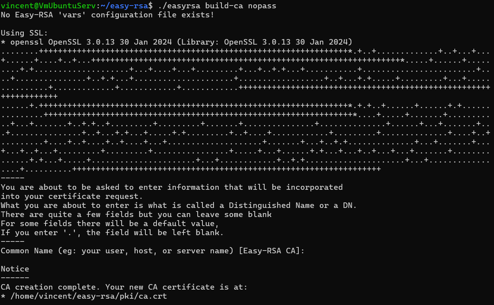

Puis je crée mon certificat client et ma clé privée client :
```./easyrsa build-client-full client1 nopass```

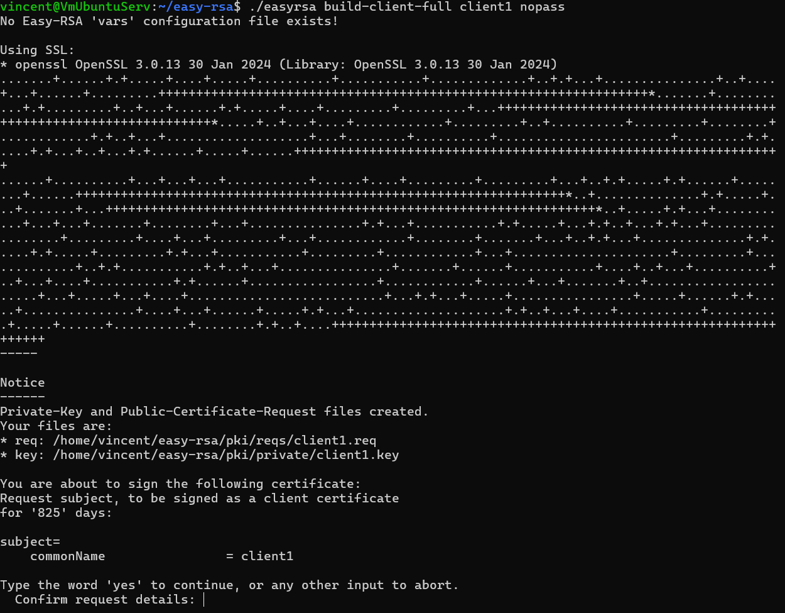

Ensuite je génère les paramètres Diffie-Hellman :
```./easyrsa gen-dh```

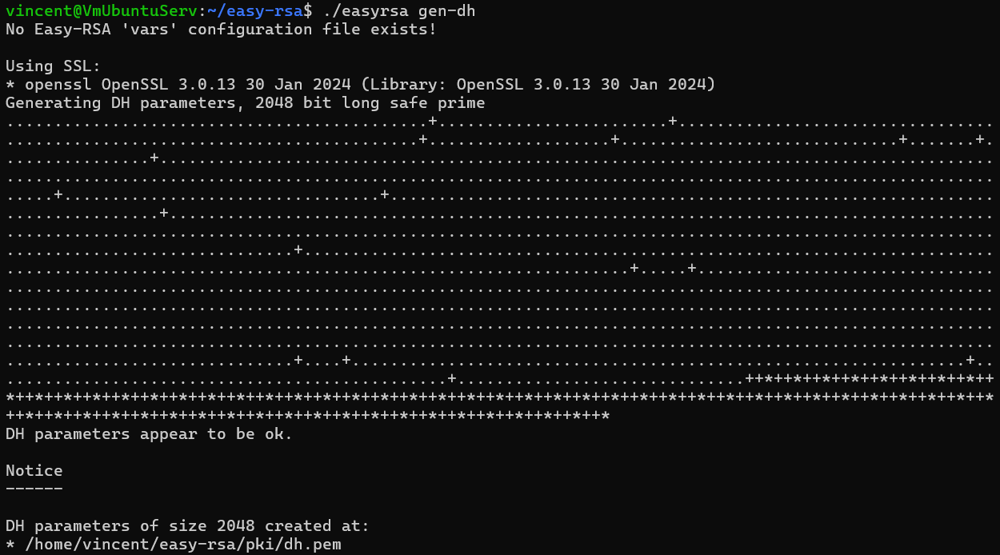

Pour finir je génère la clé TLS supplémentaire (tls-auth)
```openvpn --genkey secret pki/ta.key```

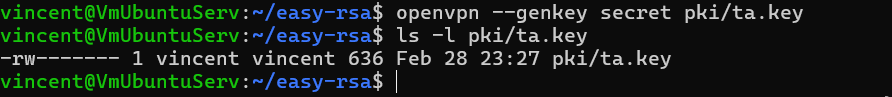

1. Dans le dossier ~/easy-rsa/pki/

2. il contient :
- ca.crt : Certificat de la CA
- private/ : Clés privées (server.key, client.key, ca.key)
- issued/ : Certificats signés (server.crt, client.crt)
- reqs/ : Demandes de certificats (CSR)
- dh.pem : Paramètres Diffie-Hellman
- ta.key : Clé TLS
- index.txt : Base de données des certificats

3. **gen-req** va générer une demande de certificat (CSR) + clé privée alors que **sign-req** signe la demande avec la CA qui crée le certificat valide

4. Le certificat n'existe pas. La connexion VPN échoue car il manque le fichier .crt signé. La clé privée seule est inutilisable

---

## Partie 2 : Configuration du serveur OpenVPN

Je commence à créer un fichier de configuration serveur :

```
./easyrsa build-server-full server nopass
sudo cp ~/easy-rsa/pki/ca.crt /etc/openvpn/server/
sudo cp ~/easy-rsa/pki/issued/server.crt /etc/openvpn/server/
sudo cp ~/easy-rsa/pki/private/server.key /etc/openvpn/server/
sudo cp ~/easy-rsa/pki/dh.pem /etc/openvpn/server/
sudo cp ~/easy-rsa/pki/ta.key /etc/openvpn/server/
```

```sudo nano /etc/openvpn/server/server.conf```

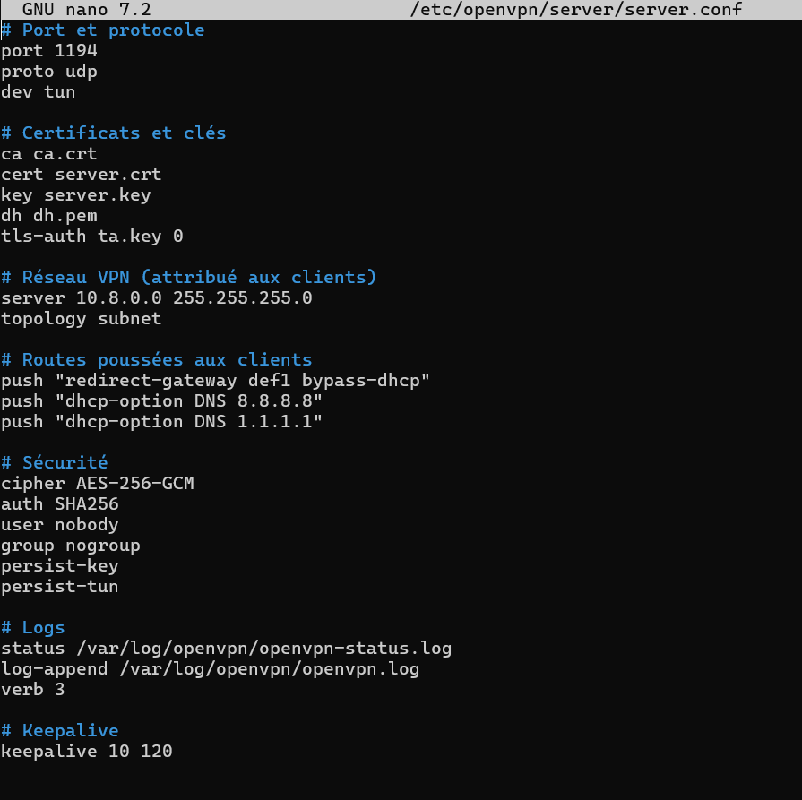

1. tun = interface réseau virtuelle de couche 3 (IP). Crée un tunnel qui route les paquets IP. Utilisé pour les VPN site-à-site ou remote access classiques.

2. La différence :
UDP :
- Plus rapide (pas de vérification d'erreurs)
- Meilleur pour streaming/jeux/VoIP
- Peut perdre des paquets sur mauvaise connexion

TCP :
- Plus fiable (garantit la livraison)
- Traverse mieux les firewalls restrictifs
- Plus lent (double encapsulation = "TCP over TCP"

3. Plage recommandée : 10.8.0.0/24 (par défaut OpenVPN)

Ensuite on va configurer et mettre en place le routage et NAT :

```
sudo sysctl -w net.ipv4.ip_forward=1
sudo nano /etc/sysctl.conf
sudo sysctl -p
sudo iptables -t nat -A POSTROUTING -s 10.8.0.0/24 -o enp0s3 -j MASQUERADE
sudo iptables -t nat -L POSTROUTING -v
sudo apt install iptables-persistent -y
```


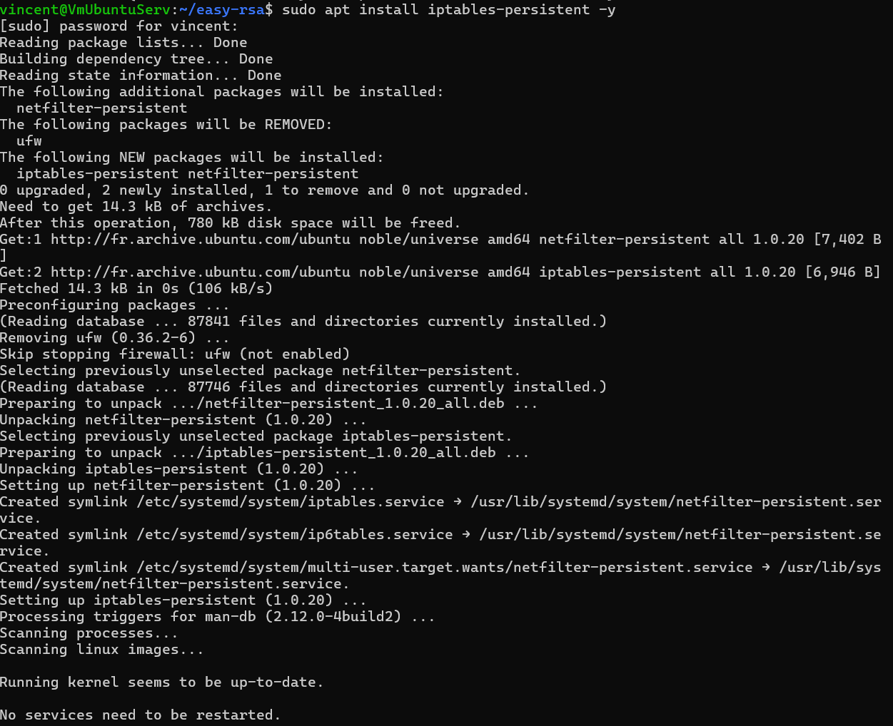

1. Dans le fichier : /etc/sysctl.conf puis ligne à décommenter/ajouter : net.ipv4.ip_forward=1

2. sudo iptables -t nat -L -v -n

3. Parce que les IP VPN (10.8.0.x) sont privées et non routables sur Internet.

Pour finir je vérifie que tout fonctionne :

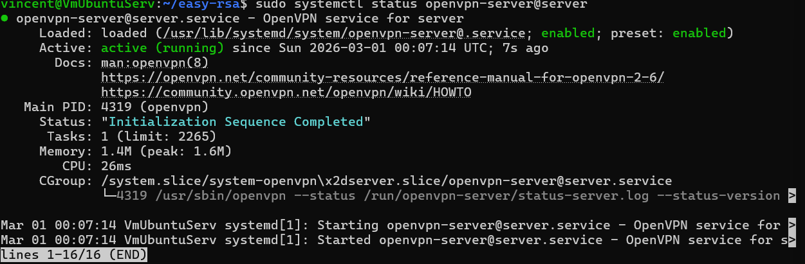

## Partie 3 : Création du profil client

Je vais maintenant créer un fichier .ovpn fonctionnel.

```
mkdir -p ~/client-configs/files
nano ~/client-configs/base.conf
nano ~/client-configs/make_config.sh
chmod +x ~/client-configs/make_config.sh
cd ~/client-configs
./make_config.sh client1
```

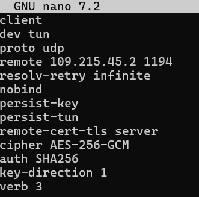
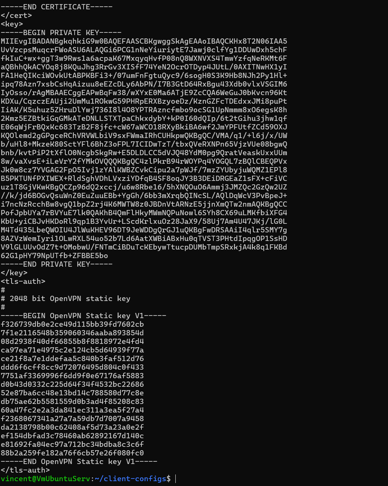

Pour finir je n'ai pas pu faire les tests et la validation mais théoriquement ça fonctionne :)

1. Je vérifie :
- Avant connexion VPN : curl ifconfig.me → ton IP réelle
- Après connexion VPN : curl ifconfig.me → IP du serveur VPN (109.215.45.2)

2. S'il est bloqué je peux : Changer de port - Changer de protocole - Utiliser un tunnel/proxy
